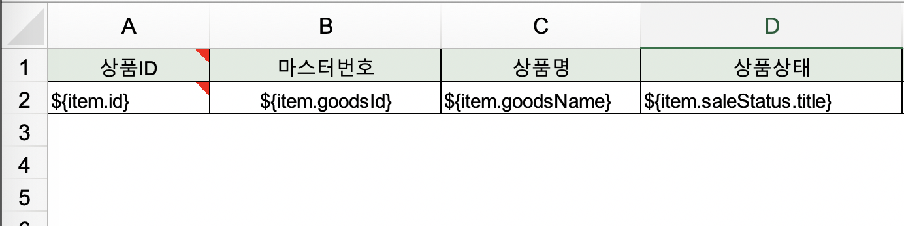

# 시작
회사를 재직하면서 운영을 위해 어드민을 만들다보면 빠질 수 없는 기능중에 하나가 엑셀다운로드인 것 같다. 
시작은 엑셀 다운로드 템플릿 없이 만들기에서 성능개선으로 끝난 엑셀 다운로드 기능에 대한 회고를 해봅니다. (구구절절 주의)


# 상황
기존 엑셀 다운로드 기능은 `JxlsHelper`라는 라이브러리를 사용해서 modelAndView로 다운로드 하는 방식이었다. 
(이 당시에는) 문제는 없었지만, 엑셀 다운로드를 하기위해서 엑셀 파일로 템플릿(헤더와 어떤 변수가 어떤 열에 들어갈지를 지정하는)을 계속 만들어줘야해서 모듈화해보면 어떨까? 하는 생각으로 시작되었다.
엑셀에 다운로드 할 전체 데이터 리스트와 JxlsHelper로 템플릿을 읽어서 넣어주면 엑셀이 다운로드가 되는 형식이다.

이 방식의 단점은 비슷하지만 열이 하나 다르거나 변수명이 다르면 그때마다 엑셀 템플릿을 새로 만들어줘야했고, 그로인해서 템플릿 파일이 아주 많아지고 있었다.
```java
// 미리 엑셀파일로 만들어둔 템플릿 파일
ExcelView view = new ExcelView("xls/templates/template.xlsx", String.format("file-name%s.xlsx",
                LocalDate.now().format(DateTimeFormatter.ofPattern("yyyyMMdd"))));
// 엑셀 파일에 넣을 전체 목록 디비 조회
List<ProductOptionDto> productOptionDtoList = productService.findProductsOption(productId);

ModelAndView modelView = new ModelAndView();
modelView.getModel().put("list", productOptionDtoList);
modelView.setView(view);
```
그리고 추후에 발생한 이슈이지만 프론트에서는 페이징 처리를 하고 있었으나 엑셀은 전체 목록을 한번에 조회해서 파일을 만들기 때문에 운영에서 데이터가 많아지니 OOM이 발생했다.
어쩌다보니 일이 이렇게 커졌다. 🤔


# 개선
우선 JxlsHelper로는 엑셀 템플릿 파일 없이 생성하기가 힘들 것 같아서 poi 라이브러리를 사용하기로 결정했다. (이미 dependency 추가가 되어 있어서 힘들지 않게 결정했다.) 
그리고 oom을 해결하기 위해 문제가 되는 부분을 찾아보니 `excel파일을 만들기 위해 조회한 데이터`와 
`조회한 데이터를 가지고 생성하는 엑셀 파일`이 파일 전체를 만들어서 다운로드 할때까지 메모리가 가지고 있기 때문에 대환장파티가 열린다는 것을 알게되었다. 하나씩 개선해보자.

### 엑셀 다운로드 모듈화
템플릿 파일을 만들기 않기 위해서는 항상 달라지는 헤더와 변수명에 대한 처리가 필요했다. 헤더에 들어갈 이름을 리스트로 입력받았다.
```java
String headers[] = new String[]{"서비스 타입", "카테고리", "판매 금액", "지불 금액", "판매 수량", "상품 개수", "총 매출(수수료)", "평균 수수료율", "취소금액"};
String keys[] = new String[]{"serviceType", "categoryTypeName", "saleAmount", "paymentAmount", "saleQuantity", "goodsCount", "feeAmount", "averCommissionRate", "cancelAmount"};
```
엑셀에 들어가는 데이터는 reflection으로 필드명을 가져와서 각 row에 입력해주었다.
```java
public void downloadExcel(List<?> data, Class targetClass, String fileName, HttpServletResponse response) throws IOException {
    keyList = targetClass.getFields();

    data.forEach(r -> createBody(r));
    sheet.flushRows(data.size());
    close(response, fileName);
}

private void createBody(Object data) {
    if (keyList != null && keyList.length > 0) {
        SXSSFRow row = sheet.createRow(++rowNum);

        for (int j = 0; j < keyList.length; j++) {
            SXSSFCell cell = row.createCell(j);

            try {
                cell.setCellValue((Optional.ofNullable(keyList[j].get(data)).map(r -> String.valueOf(r)).orElse("")));
            } catch (IllegalAccessException e) {
                cell.setCellValue("");
            }
        }
    }
}
```
그러다보니 뷰를 위해 조회되는 리스트와 엑셀 다운로드를 위한 리스트가 조금 다르기도 했다. (필드의 순서가 열의 순서가 되는 점, 프론트에서 조합해서 쓰는 변수 등)
그래서 엑셀 다운로드를 위한 dto를 만들어줘야하는 까다로움이 또 생기긴 했다.

### 메모리를 점유하지 않는 엑셀 파일 생성하기 (feat. Poi SXSSF) 
다운로드 하고자하는 엑셀 파일 전체가 만들어질때까지 메모리를 점유하기 때문에 생기는 문제를 해결하기 위해서는 SXSSF를 사용하면 됐다.
SXSSF는 SXXF의 streaming api로 xml 임시 파일을 하나 만들어서 엑셀을 만드는 중간중간 다운로드하도록 하고 메모리를 비우는 방식이다.
1. `new SXSSFWorkbook()` : SXSSF workbook 생성 ( ROW_ACCESS_WINDOW_SIZE 설정. default: 100 )
2. `sheet.createRow()`: 로우 데이터 생성
   1. `sheet.flushRows(ROW_ACCESS_WINDOW_SIZE)`: 메모리 상의 데이터가 ROW_ACCESS_WINDOW_SIZE 수 이상이면 디스크에 임시 파일(xml)로 flush 하고 메모리에서 데이터 삭제
3. `sheet.flushRows()` : 남은 데이터 임시 파일로 flush 후 데이터 삭제
4. `workbook.write()`: 임시 파일 통해서 xlsx 파일 생성하여 OutputStream.write
5. `workbook.dispose()`: dispose호출하여 임시 xml 파일 삭제

```java
public class ExcelHandler {
    private final SXSSFWorkbook workbook;
    private final SXSSFSheet sheet;
    private Field[] keyList;
    private int rowNum;

    private final int ROW_ACCESS_WINDOW_SIZE = 1000;
    private final int FIRST_SHEET_INDEX = 0;

    public ExcelHandler(String templateUri) throws IOException {
        InputStream templateFile = Thread.currentThread().getContextClassLoader().getResourceAsStream(templateUri);
        XSSFWorkbook xssfWorkbook = new XSSFWorkbook(templateFile);

        Sheet originSheet = xssfWorkbook.getSheetAt(FIRST_SHEET_INDEX);
        rowNum = originSheet.getLastRowNum();

        workbook = new SXSSFWorkbook(xssfWorkbook, ROW_ACCESS_WINDOW_SIZE);
        sheet = workbook.getSheetAt(FIRST_SHEET_INDEX);
    }

    ...

    public void close(HttpServletResponse response, String fileName) {
        try {
            response.setHeader("Set-Cookie", "fileDownload=true; path=/");
            response.setHeader("Content-Disposition", String.format("attachment; filename=%s.xlsx", fileName));

            workbook.write(response.getOutputStream());
        } catch (IOException e) {
            log.error("Excel Download Error. {} {}", e.getMessage(), e.getStackTrace());
        } finally {
            workbook.dispose();
        }
    }

}
```

### ResultHandler
마지막으로 db에서 데이터 조회를 한번에 전체를 하는게 아닌 순차적으로 할 수 있도록 resultHandler를 도입했다.
resultHandler는 fetchSize를 설정하여 해당 사이즈만큼의 로우를 조회후 콜백으로 함수를 호출해서 사용하고 메모리에서 제거되는 방식이다.
그래서 resultHandler를 사용하기 위해서는 ResultHandler를 상속받고, handleResult() 메소드를 오버라이드 하여 필요한 작업을 이 메소드에서 하면된다.
```java
public void findProductOptionByProductId(SearchDto searchDto, ExcelResultHandler excelResultHandler) {
    productMapper.findProductOptionByProductId(reportByCategorySearchDto, excelResultHandler);
}
```
```xml
<select id="findProductOptionByProductId"
        fetchSize="-2147483648"
        parameterType="..."
        resultType="Map">
    ...
</select>
```
```java
public class ExcelResultHandler implements ResultHandler {
    private final SXSSFWorkbook wb;
    private final SXSSFSheet sheet;
    private int rowNum;
    private String keys[];

    public ExcelResultHandler() {
        wb = new SXSSFWorkbook(1000);
        sheet = wb.createSheet();
        rowNum = 0;
    }

    public void downloadExcel(Runnable findData, String[] headers, String[] keys, String fileName, HttpServletResponse response) {
        this.keys = keys;

        createTitle(rowNum, headers);
        findData.run();
        close(response, fileName);
    }

    @Override
    public void handleResult(ResultContext resultContext) {
        createBody((Map) resultContext.getResultObject());
    }

    private void createTitle(int currentRow, String[] headers) {
        if (headers != null && headers.length > 0) {
            SXSSFRow row = sheet.createRow(currentRow);

            for (int j = 0; j < headers.length; j++) {
                SXSSFCell cell = row.createCell(j);
                cell.setCellValue(headers[j]);
                cell.setCellStyle(getTitleStyle());
            }
        }
        rowNum = currentRow + 1;
    }

    private CellStyle getTitleStyle() {
        CellStyle titleStyle = wb.createCellStyle();
        titleStyle.setFillForegroundColor(HSSFColor.HSSFColorPredefined.GREEN.getIndex());
        titleStyle.setFillPattern(FillPatternType.SOLID_FOREGROUND);
        titleStyle.setAlignment(HorizontalAlignment.CENTER);

        return titleStyle;
    }

    private void createBody(Map data) {
        if (keys != null && keys.length > 0) {
            SXSSFRow row = sheet.createRow(rowNum++);

            for (int j = 0; j < keys.length; j++) {
                SXSSFCell cell = row.createCell(j);
                cell.setCellValue(Optional.ofNullable(data.get(keys[j])).map(r -> String.valueOf(r)).orElse(""));
            }
        }
    }

    public void close(HttpServletResponse response, String fileName) {
        try {
            response.setHeader("Set-Cookie", "fileDownload=true; path=/");
            response.setHeader("Content-Disposition", String.format("attachment; filename=%s.xlsx", fileName));

            wb.write(response.getOutputStream());
        } catch (IOException e) {
            log.error("Excel Download Error. {} {}", e.getMessage(), e.getStackTrace());
        } finally {
            wb.dispose();
        }
    }
}
```


# 결론
//TODO 결론

그래도 남아있는 문제는 14초가 짧은 시간이 아니기 때문에 사용자가 기다리지 않고 여러번 다운로드 버튼을 누르는 경우나 데이터는 계속 늘어난다는 점들이 있었다.
우선은 프론트에서 엑셀다운로드를 처리하고 있을때는 버튼 클릭을 막았고, 검색조건에 대해서 리밋 (최대 검색기간을 넣었지만 이것도... 장사가 잘되면.. 😒)을 걸어두는 것으로 끝냈다.

엑셀 다운로드를 개선하면서 주변에서 조언도 많이 해주셨다. 조언 받은 내용은 result handler대신 `Cursor`를 사용할 수 도 있고,
어드민 서버에서 엑셀 파일을 실시간으로 다운로드를 꼭 해야하는게 아니라면 queue와 배치 서버를 두고 요청시에 zip파일 압축하여 메일로 받아볼 수 있도록 처리하는 방법도 있다고 한다.
나중에 또 문제가 발생한다면 이 방법들에 대해서도 고려를 해봐야할 것 같다. 


# 참고 문서
