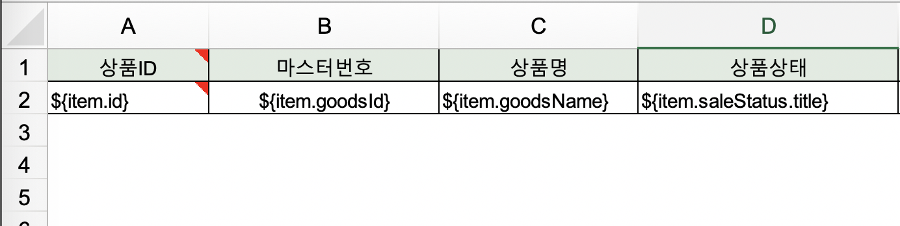

운영을 위해 어드민을 만들다보면 빠질 수 없는 기능중에 하나가 엑셀다운로드인 것 같다. 
시작은 엑셀 다운로드 템플릿 없이 만들기에서 성능개선으로 끝난 엑셀 다운로드 기능에 대한 회고를 해봅니다. (구구절절 주의)


## 시작
기존 엑셀 다운로드 기능은 `JxlsHelper`라는 라이브러리를 사용해서 modelAndView로 다운로드 하는 방식이었다. 
(이 당시에는) 문제는 없었지만, 엑셀 다운로드를 하기위해서 엑셀 파일로 템플릿(헤더와 어떤 변수가 어떤 열에 들어갈지를 지정하는)을 계속 만들어줘야했다.

이 방식의 단점은 비슷하지만 열이 하나 다르거나 변수명이 다르면 그때마다 엑셀 템플릿을 새로 만들어줘야했고, 그로인해서 템플릿 파일이 계속 많아지고 있었다. 그래서 모듈화해보면 어떨까? 하는 생각으로 시작되었다.

```java
// 미리 엑셀파일로 만들어둔 템플릿 파일
ExcelView view = new ExcelView("xls/templates/template.xlsx", String.format("file-name%s.xlsx",
                LocalDate.now().format(DateTimeFormatter.ofPattern("yyyyMMdd"))));
// 엑셀 파일에 넣을 전체 목록 디비 조회
List<ProductOptionDto> productOptionDtoList = productService.findProductsOption(productId);

ModelAndView modelView = new ModelAndView();
modelView.getModel().put("list", productOptionDtoList);
modelView.setView(view);
```
그리고 추후에 발생한 이슈이지만 프론트에서는 페이징 처리를 하고 있었으나 엑셀은 전체 목록을 한번에 조회해서 파일을 만들기 때문에 운영에서 데이터가 많아지니 (약 5만건) 결국 OOM이 발생했다. 🙊


## 개선
우선 JxlsHelper로는 엑셀 템플릿 파일 없이 생성하기가 힘들 것 같아서 1️⃣`poi 라이브러리를 사용하여 템플릿 없이 모듈화`하기로 결정했다.
그리고 oom을 해결하기 위해 문제가 되는 부분을 찾아보니 2️⃣`excel파일을 만들기 위해 조회한 데이터`와 3️⃣`조회한 데이터를 가지고 생성하는 엑셀 파일`이 파일 전체를 만들어서 다운로드 할때까지 메모리가 가지고 있기 때문에 대환장파티가 열린다는 것을 알게되었다. 이제 하나씩 개선해보자.

### 1️⃣ 엑셀 다운로드 모듈화
템플릿 파일을 만들기 않기 위해서는 항상 달라지는 헤더와 변수명에 대한 처리가 필요했다. 헤더에 들어갈 이름을 리스트로 입력받았다.
```java
String headers[] = new String[]{"서비스 타입", "카테고리", "판매 금액", "지불 금액", "판매 수량", "상품 개수", "총 매출(수수료)", "평균 수수료율", "취소금액"};
String keys[] = new String[]{"serviceType", "categoryTypeName", "saleAmount", "paymentAmount", "saleQuantity", "goodsCount", "feeAmount", "averCommissionRate", "cancelAmount"};
```
엑셀에 들어가는 데이터 (필드명)도 입력받은대로 row를 채워넣었다.
```java
public void downloadExcel(Runnable findData, String[] headers, String[] keys, String fileName, HttpServletResponse response) {
    this.keys = keys;

    createTitle(rowNum, headers);
    ...
}

// 헤더 생성
private void createTitle(int currentRow, String[] headers) {
    if (headers != null && headers.length > 0) {
        SXSSFRow row = sheet.createRow(currentRow);

        for (int j = 0; j < headers.length; j++) {
            SXSSFCell cell = row.createCell(j);
            cell.setCellValue(headers[j]);
        }
    }
    rowNum = currentRow + 1;
}

// body row 생성
private void createBody(Map data) {
    if (keys != null && keys.length > 0) {
        SXSSFRow row = sheet.createRow(rowNum++);

        for (int j = 0; j < keys.length; j++) {
            SXSSFCell cell = row.createCell(j);
            cell.setCellValue(Optional.ofNullable(data.get(keys[j])).map(r -> String.valueOf(r)).orElse(""));
        }
    }
}
```
이렇게 만들고 나니 저렇게 입력을 하드코딩 하는 부분이 맘에 들지 않는다는 민원이 들어왔다. 🤭
그래서 헤더가 있는 템플릿 파일을 읽을 수도 있게끔 만들었고, reflection 으로 필드명을 가져와서 row를 채울 수 있도록 변경했다.


### 2️⃣ ResultHandler
db에서 데이터 조회를 한번에 전체를 하는게 아닌 순차적으로 할 수 있도록 resultHandler를 도입했다.
resultHandler는 fetchSize를 설정하여 해당 사이즈만큼의 로우를 조회 후 콜백으로 함수를 호출해서 사용하고 메모리에서 제거되는 방식이다.

```java
public void findProductOptionByProductId(SearchDto searchDto, ExcelResultHandler excelResultHandler) {
    productMapper.findProductOptionByProductId(reportByCategorySearchDto, excelResultHandler);
}
```
fetchSize를 -2147483648(= Integer.MIN_VALUE)로 설정하면 1개의 로우씩 조회하고 handlerResult를 호출한다.
```xml
<select id="findProductOptionByProductId"
        fetchSize="-2147483648"
        parameterType="..."
        resultType="Map">
    ...
</select>
```
ResultHandler를 상송받은 후 handleResult메소드를 오버라이드하여 원하는 작업을 하면 된다.
```java
@Slf4j
public class ExcelResultHandler implements ResultHandler {
    private final SXSSFWorkbook wb;
    private final SXSSFSheet sheet;
    private int rowNum;
    private String keys[];

    ...

    @Override
    public void handleResult(ResultContext resultContext) {
        createBody((Map) resultContext.getResultObject());
    }

    private void createBody(Map data) {
        if (keys != null && keys.length > 0) {
            SXSSFRow row = sheet.createRow(rowNum++);

            for (int j = 0; j < keys.length; j++) {
                SXSSFCell cell = row.createCell(j);
                cell.setCellValue(Optional.ofNullable(data.get(keys[j])).map(r -> String.valueOf(r)).orElse(""));
            }
        }
    }
}
```
이 방법의 단점은 데이터 가공(개인정보 마스킹, 숫자에 콤마 추가해주기 등)이 어려운점이 있었다. handleResult가 호출되었을때 데이터에 대한 전처리를 하는 메소드를 함께 보낼 수도 있을 거 같긴한데 해보진 않았다.
데이터 가공이 필요하다면 쿼리로 작업을 해줬는데 아주 맘에 들진 않지만.. 우선 이렇게 ...


### 3️⃣ 메모리를 점유하지 않는 엑셀 파일 생성하기 (feat. Poi SXSSF) 
다운로드 하고자하는 엑셀 파일 전체가 만들어질때까지 메모리를 점유하기 때문에 생기는 문제를 해결하기 위해서 `SXSSF`를 사용했다.
`SXSSF`는 SXXF의 streaming api로써, 파일 전체가 만들어질때까지 생성중인 파일이 메모리를 점유하지 않도록 xml 임시 파일을 하나 만들어서 엑셀을 만드는 중간중간 다운로드하도록 하고 
메모리를 비우고, 전체 파일이 생성되면 임시 파일로 엑셀파일을 만드는 방식으로 파일을 생성한다.
1. `new SXSSFWorkbook()` : SXSSF workbook 생성 ( ROW_ACCESS_WINDOW_SIZE 설정. default: 100 )
2. `sheet.createRow()`: 로우 데이터 생성
   1. `sheet.flushRows(ROW_ACCESS_WINDOW_SIZE)`: 메모리 상의 데이터가 ROW_ACCESS_WINDOW_SIZE 수 이상이면 디스크에 임시 파일(xml)로 flush 하고 메모리에서 데이터 삭제
3. `sheet.flushRows()` : 남은 데이터 임시 파일로 flush 후 데이터 삭제
4. `workbook.write()`: 임시 파일 통해서 xlsx 파일 생성하여 OutputStream.write
5. `workbook.dispose()`: dispose호출하여 임시 xml 파일 삭제

```java
public class ExcelHandler {
    private final SXSSFWorkbook workbook;
    private final SXSSFSheet sheet;
    private Field[] keyList;
    private int rowNum;

    // 메모리에 ROW_ACCESS_WINDOW_SIZE이상 ROW가 생성되면 임시파일로 플러시
    private final int ROW_ACCESS_WINDOW_SIZE = 1000;
    private final int FIRST_SHEET_INDEX = 0;

    public ExcelHandler(String templateUri) throws IOException {
        InputStream templateFile = Thread.currentThread().getContextClassLoader().getResourceAsStream(templateUri);
        // SXSSF workbook 생성
        XSSFWorkbook xssfWorkbook = new XSSFWorkbook(templateFile);

        // sheet생성
        Sheet originSheet = xssfWorkbook.getSheetAt(FIRST_SHEET_INDEX);
        // 헤더를 포함한 템플핏 파일과 함께 사용하기 위해서 마지막 로우넘버부터 데이터를 채워넣음
        rowNum = originSheet.getLastRowNum();

        workbook = new SXSSFWorkbook(xssfWorkbook, ROW_ACCESS_WINDOW_SIZE);
        sheet = workbook.getSheetAt(FIRST_SHEET_INDEX);
    }

    public void downloadExcel(List<?> data, Class targetClass, String fileName, HttpServletResponse response) throws IOException {
        keyList = targetClass.getFields();

        data.forEach(r -> createBody(r));
        // ROW_ACCESS_WINDOW_SIZE 나머지 수 임시파일에 플러시
        sheet.flushRows(data.size());
        close(response, fileName);
    }
    
    private void createBody(Object data) {
        // reflection을 통해 field명 가져옴
        Field[] keyList = data.getClass().getDeclaredFields();

        if (ArrayUtils.isEmpty(keyList)) {
            return;
        }

        SXSSFRow row = sheet.createRow(++rowNum);

        for (int j = 0; j < keyList.length; j++) {
            SXSSFCell cell = row.createCell(j);

            try {
                cell.setCellValue((Optional.ofNullable(keyList[j].get(data)).map(String::valueOf).orElse("")));
            } catch (IllegalAccessException e) {
                cell.setCellValue("");
            }
        }
    }

    public void close(HttpServletResponse response, String fileName) {
        try {
            response.setHeader("Set-Cookie", "fileDownload=true; path=/");
            response.setHeader("Content-Disposition", String.format("attachment; filename=%s.xlsx", fileName));

            // outputStream에 전송
            workbook.write(response.getOutputStream());
        } catch (IOException e) {
            log.error("Excel Download Error. {} {}", e.getMessage(), e.getStackTrace());
        } finally {
            // 생성한 임시 파일 삭제
            workbook.dispose();
        }
    }
}
```

## 결론
개선을 통해서 OOM이 발생했던 5만건 이상의 데이터도 문제없이 다운로드 되었다.

그래도 남아있는 문제는 다운로드에 약 10초의 시간이 소요되었기 때문에 사용자가 기다리지 않고 여러번 다운로드 버튼을 누르는 경우등이 있었다.
우선은 프론트에서 엑셀다운로드를 처리하고 있을때는 버튼 클릭을 막았고, 검색조건에 대해서 리밋 (최대 검색기간이나 필수조건 등)을 걸어두는 것으로 끝냈다.

엑셀 다운로드를 개선하면서 주변에서 조언도 많이 해주셨는데, 다음에 고려해볼 내용들이라서 함께 정리한다. 
result handler대신 `Cursor`를 사용할 수 도 있고, 어드민 서버에서 엑셀 파일을 실시간으로 다운로드를 꼭 해야하는게 아니라면 queue와 배치 서버를 두고 요청시에 zip파일 압축하여 메일로 받아볼 수 있도록 처리하는 방법도 있다고 한다.
나중에 또 문제가 발생한다면 이 방법들에 대해서도 고려를 해봐야할 것 같다. :)


## 참고 문서
https://blog.naver.com/tmondev/221388780914
[https://hyeonguj.github.io](https://hyeonguj.github.io/2019/02/28/%EB%8C%80%EC%9A%A9%EB%9F%89-%EC%97%91%EC%85%80%ED%8C%8C%EC%9D%BC-%EB%8B%A4%EC%9A%B4%EB%A1%9C%EB%93%9C-oom-%EB%B0%A9%EC%A7%80-%EA%B0%80%EC%9D%B4%EB%93%9C/)
